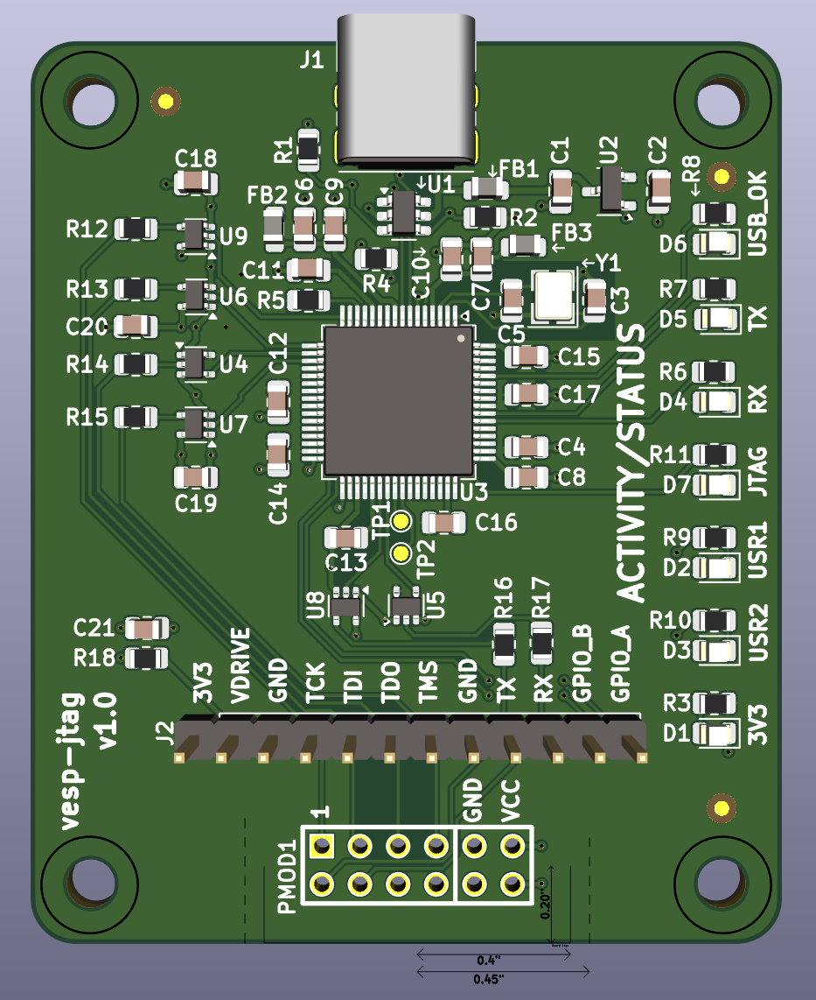
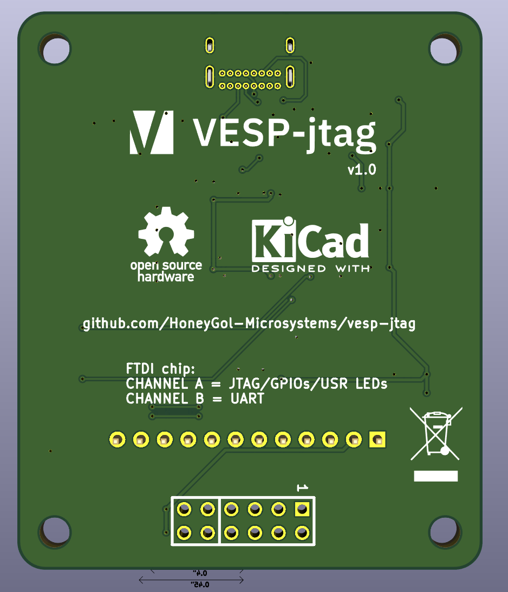
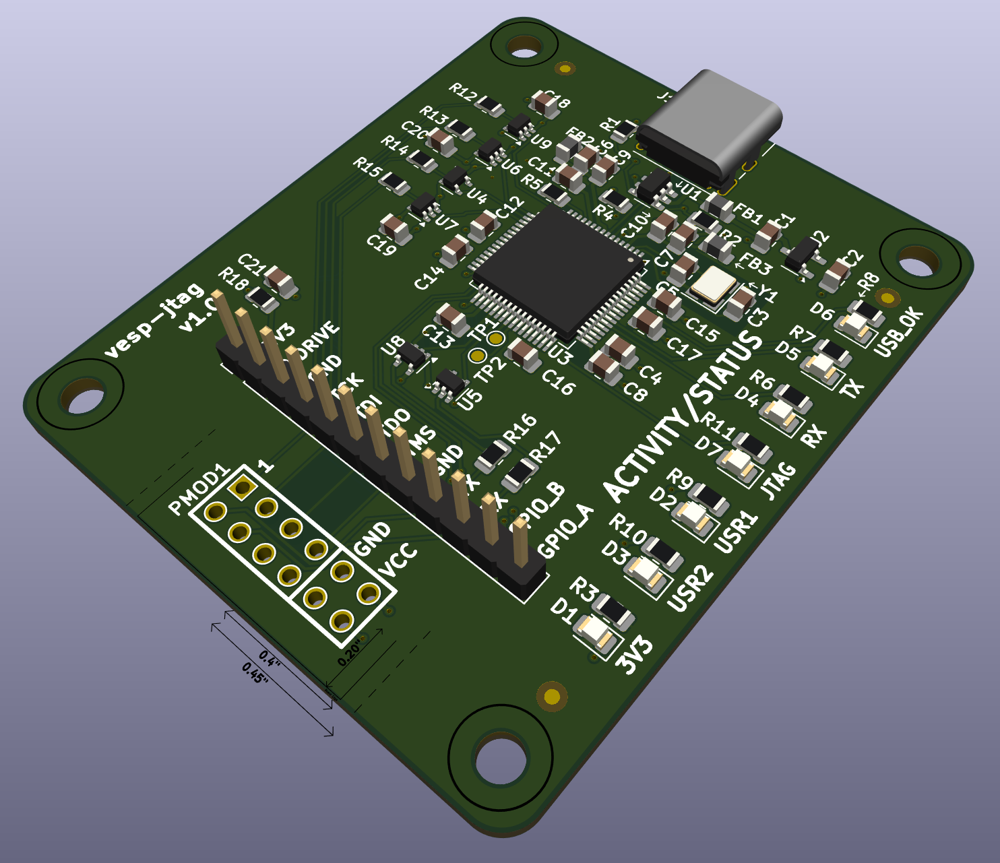

# 
Open Source Hardware JTAG/UART/GPIO interface board based on amazing [Steppenprobe](https://github.com/diegoherranz/steppenprobe) containing Pmod-compatible connector.

## Basic specs:

- Open Source Hardware and designed in [KiCad](https://kicad.org).
- Majority of footprints have easy to solder 0805 packages.
- [FT2232H](https://ftdichip.com/products/ft2232hl)-based,
- Simultaneous operation of JTAG/UART or GPIO/UART (software-configurable).
- Standard Pmod connector for direct connection to a compatible FPGA.
- USB powered: no power supply needed.
- USB type-C receptacle: more convenient (reversible) and future-proof.
- Signals also available on 2.54 mm pin header to work with any custom pinout.
- 2 GPIO and 2 user-controllable LEDs.
- I/O buffers for protection and to be able to use a wide voltage range (1.65 V to 5.5 V).
- Descriptive LED indicators.
- (TODO) OpenOCD compatibility.

*Please note that the board itself is wider than the Pmod standard allows, therefore it is not entirely "Pmod compatible". It may happen that if Pmod ports on your FPGA board are too close to each other, another Pmod board will not fit next to the vesp-jtag at the same time.*

## Schematic PDF, Gerbers and other generated files:
See [releases](https://github.com/HoneyGol-Microsystems/vesp-jtag/releases).

## FTDI channels

The FT2232H has 2 independent channels. In this board:

- Channel A: Used as JTAG or GPIOs
- Channel B: Used as UART.

After enumeration, both channels will default to UART mode, so on a Linux system they will show up as `/dev/ttyUSB0` and `/dev/ttyUSB1`. When channel A gets reconfigured to MPSSE mode (e.g. when using OpenOCD with it), then `/dev/ttyUSB0` will disappear and channel B will remain as `/dev/ttyUSB1`.

## 3D renders

  

## OpenOCD example commands
TODO